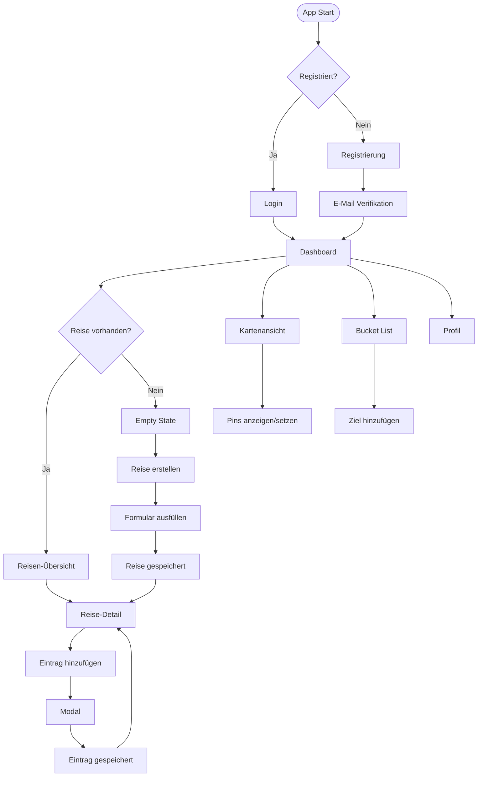
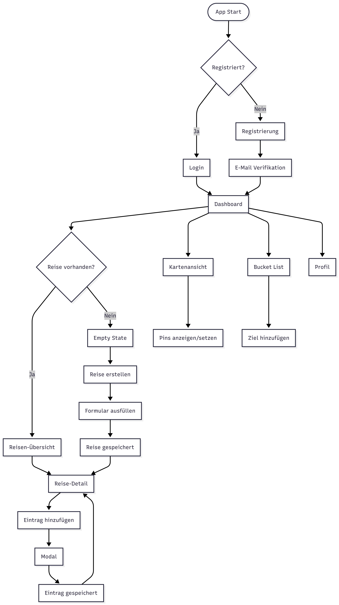
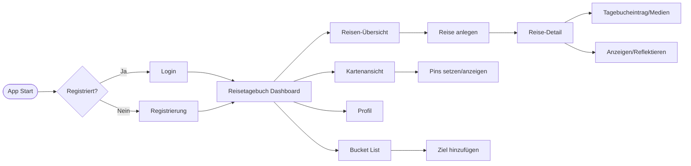

# Projektdokumentation - Reisetagebuch

## Inhaltsverzeichnis

1. [Einordnung & Zielsetzung](#1-einordnung--zielsetzung)
2. [Zielgruppe & Stakeholder](#2-zielgruppe--stakeholder)
3. [Anforderungen & Umfang](#3-anforderungen--umfang)
4. [Vorgehen & Artefakte](#4-vorgehen--artefakte)
    - [Understand & Define](#41-understand--define)
    - [Sketch](#42-sketch)
    - [Decide](#43-decide)
    - [Prototype](#44-prototype)
    - [Validate](#45-validate)
    - [Reflexion & Fazit](#46-reflexion--fazit)
5. [Erweiterungen [Optional]](#5-erweiterungen-optional)
6. [Projektorganisation [Optional]](#6-projektorganisation-optional)
7. [KI-Deklaration](#7-ki-deklaration)
8. [Anhang [Optional]](#8-anhang-optional)

> **Hinweis:** Massgeblich sind die im **Unterricht** und auf **Moodle** kommunizierten Anforderungen.

<!-- WICHTIG: DIE KAPITELSTRUKTUR DARF NICHT VERÄNDERT WERDEN! -->

<!-- Diese Vorlage ist für eine README.md im Repository gedacht. Abschnitte mit [Optional] können weggelassen werden, wenn in den Übungen nichts anderes verlangt wird. -->

## 1. Einordnung & Zielsetzung
**Kontext & Problem:** Reiseerlebnisse liegen verstreut in Notizen, Fotos und Chats; ein zentraler, reflektierbarer Überblick fehlt. Das Reisetagebuch bündelt Erinnerungen und erleichtert späteres Reflektieren.  
**Ziel:** Webbasierter Prototyp, mit dem Nutzer:innen Reisen anlegen, Erlebnisse festhalten und reflektieren – Fokus auf Erinnerungen statt Buchung/Planung.  
**Erfolgskennzahlen:** Erfassung einer Reise inklusive drei Einträgen in unter 5 Minuten; mindestens 80 % der Testenden finden ihre letzten drei Einträge ohne Hilfe; mindestens 70 % bewerten die Übersichtlichkeit als „gut“ oder besser.  
**Abgrenzung:** Keine Reisebuchungen, Empfehlungen oder KI-Auswertungen; schlanker, validierbarer MVP. Technik-Stack/Tooling in Abschnitt 4/7.

## 2. Zielgruppe & Stakeholder
**Primäre Zielgruppe:**  
Reisende (Einzelpersonen, Paare, Familien, Studierende/Backpacker:innen), die 1 bis 3 Freizeit-Reisen pro Jahr machen und nach der Reise Erlebnisse strukturiert und ohne komplexe Tools festhalten wollen – mit Text, Fotos/Medien, Ortsbezug und Bucket-List-Ideen.  

**Weitere Stakeholder:**  
Dozierende/Projektbetreuung (Bewertung von Konzept, Umsetzung, Doku), Testnutzende (Feedback zu Verständlichkeit/UX/Mehrwert), Technik/Hosting (stellt MVP-Datenhaltung/Schnittstellen bereit; kein Live-Sync, keine Verfügbarkeits-Garantien).  

**Annahmen (zu validieren):**  
- 70 % bevorzugen Dokumentation nach der Reise (reflektiert, zusammenhängend).  
- Freitext plus optionale Medien/Orte/Tags werden Pflichtformularen vorgezogen (mindestens 70 % Zustimmung).  
- Ruhiges, klar strukturiertes UI unterstützt Erinnerungsarbeit besser als überladene Oberflächen (mindestens 70 % bewerten Übersichtlichkeit positiv).  
- Kombination aus vergangenen Reisen und Bucket-List steigert langfristigen Nutzen (Nutzende erfassen mindestens ein zukünftiges Ziel).  
- Niedrige Einstiegshürde (Einloggen/Start in unter 30 Sekunden) erhöht Akzeptanz in Tests.

## 3. Anforderungen & Umfang

**User Stories**  
- Als reisende Person möchte ich mir ein Benutzerkonto anlegen und es über eine Verifikations-E-Mail bestätigen, damit meine Reisedaten sicher gespeichert und mir eindeutig zugeordnet werden können.  
- Als reisende Person möchte ich eine neue Reise mit Titel, Zeitraum und Reiseziel anlegen, damit ich meine Erlebnisse strukturiert dokumentieren kann.  
- Als reisende Person möchte ich nach der Reise Tagebucheinträge mit Text, Datum und Ort erfassen, damit ich meine Erinnerungen festhalten kann.  
- Als reisende Person möchte ich Fotos und Medien zu einzelnen Einträgen hinzufügen, damit meine Erlebnisse visuell ergänzt werden.  
- Als reisende Person möchte ich meine Reisen und Einträge später übersichtlich durchblättern und durchsuchen können, um Erinnerungen zu reflektieren oder erneut aufzurufen.  

**INVEST-Qualität**  
- Unabhängig: Account, Reise anlegen, Eintrag erfassen, Medien hinzufügen, Übersicht sind getrennt umsetzbar.  
- Verhandelbar: Details wie Verifikationsart, Pflichtfelder oder Medienformate sind anpassbar ohne Kernziel zu ändern.  
- Wertvoll: Jede Story stiftet Mehrwert (Datensicherheit, Struktur, Erinnerung, Reflexion).  
- Abschätzbar: Jede Story entspricht einem klar abgegrenzten Feature.  
- Testbar: Erfolgskriterien sind konkret (Account aktiviert, Reise sichtbar, Eintrag gespeichert, Medien angezeigt).  

**Kernfunktionalität (Mindestumfang)**  
- Konto erstellen und verifizieren: Registrierungsformular -> Verifikations-E-Mail -> freigeschalteter Account.  
- Reise anlegen: Dashboard/Reiseliste -> Formular -> Reise-Detailansicht.  
- Tagebucheintrag erstellen: Reise-Detail -> Eingabemaske -> Eintrag gespeichert.  
- Medien hinzufügen: Eintrag bearbeiten -> Medienauswahl -> Anzeige im Eintrag.  
- Reisen und Einträge anzeigen/durchsuchen: Listen- und Detailansichten mit einfacher Suche/Filter zur Reflexion und Archivierung.  
- Mindestumfang entspricht den in den Übungen bis Semesterwoche 8 erarbeiteten Funktionalitäten.  

**Akzeptanzkriterien**  
- Nutzende können ein Benutzerkonto anlegen und dieses über eine Verifikations-E-Mail erfolgreich aktivieren.  
- Nach erfolgreicher Verifikation können Nutzende eine Reise mit Titel, Zeitraum und Ziel ohne Fehlermeldung anlegen.  
- Tagebucheinträge mit Text und Datum lassen sich erstellen und werden korrekt einer Reise zugeordnet.  
- Hochgeladene Bilder oder Medien werden einem Eintrag zugewiesen und korrekt angezeigt.  
- Reisen und Einträge bleiben nach einem Reload erhalten und können erneut geladen werden.  
- Listen/Detailansichten erlauben das Durchsuchen/Filtern der Einträge; Ergebnisse werden korrekt angezeigt.  
- Die Anwendung ist auf gängigen Bildschirmgrößen nutzbar, ohne Layout- oder Funktionsbrüche.  

**Erweiterungen [Optional]**  
- Bucket-List für zukünftige Reisen.  
- Kartenansicht mit bereisten Orten.  
- Stichworte/Tags zur besseren Organisation.  
- Such- und Filterfunktionen.  
- Export einzelner Reisen (z. B. als PDF).  

**Zukünftige Arbeiten [Optional]**  
- Zeitstrahl-Darstellung von Reisen und Einträgen.  
- Erweiterte Medienverwaltung (Video, Audio).  
- Synchronisation über mehrere Geräte.  
- Erweiterte Benutzerverwaltung (Passwort-Reset, Profil).  
- Mehrsprachigkeit und barrierearme Komponenten.  

## 4. Vorgehen & Artefakte
Die Umsetzung erfolgte phasenbasiert entlang eines nutzerzentrierten Design- und Prototyping-Prozesses.

### 4.1 Understand & Define
- **Ausgangslage & Ziele:** Reiseerinnerungen sind über Geräte/Apps verteilt (Galerie, Notizen, Social Media). Ziel ist ein privates, digitales Reisetagebuch, das Reisen zentral erfasst, Erinnerungen strukturiert festhält und Bucket-List-Ideen sammelt. Keine soziale Plattform, sondern persönliches Archiv.  
- **Zielgruppenverständnis:** Reisende jeder Altersgruppe; Nutzung primär nach der Reise (Reflexion/Archivierung) und vor der Reise (Bucket List/Inspiration). Basis: eigene Erfahrung, informelle Gespräche mit Reisenden, Feedback aus Kleinklasse.  
- **Wesentliche Erkenntnisse:**  
  i. Zentraler Überblick wichtiger als tiefe Einzelfeatures.  
  ii. Einfache, visuelle Erfassung mit wenig Setup.  
  iii. Klare Struktur und reduzierte Navigation für Verständlichkeit.  
  iv. Privatnutzung ohne Social-Sharing als Mehrwert.  
  v. Kartenansicht unterstützt räumliche Erinnerung.  

#### App Flow / User Journey
Der folgende Flow zeigt den typischen Nutzungspfad durch die Anwendung:



**App Flow als Bild:**  


### 4.2 Sketch
- **Ansatz:** Quantität vor Qualität (Low-Fidelity), mehrere Struktur- und Navigationskonzepte. Skizzen auf Papier und einfache Figma-Layouts.  

**Varianten-Vergleich:**  
| Variante | Beschreibung | Vorteile | Nachteile | Entscheid |
| -------- | ------------ | -------- | --------- | --------- |
| A: Timeline | Chronologischer Strang aller Reisen/Einträge | Intuitive Zeitdarstellung | Unübersichtlich bei vielen Einträgen, schwer erweiterbar | ✗ Verworfen |
| B: Hub & Detail | Zentrale Übersicht + dedizierte Detailseiten | Klare Struktur, skalierbar, einfache Navigation | Mehr Klicks nötig | ✓ Gewählt |
| C: Galerie-first | Bildergalerie als Haupteinstieg | Visuell ansprechend | Texteinträge unterrepräsentiert, Performance-Risiko | ✗ Verworfen |

- **Learnings:** Timeline zu komplex bei vielen Reisen; Galerie-first benachteiligt textbasierte Einträge; Hub & Detail bietet beste Balance aus Übersicht und Tiefe.  
- **Begründung gewählte Variante:** Hub & Detail wurde gewählt, weil die Start-Übersicht klar bleibt, Detailseiten tief gehen können und Erweiterungen (Karte/Bucket) skalierbar bleiben.

### 4.3 Decide
- **Gewählte Variante & Begründung:** Zentrales Dashboard (Reisetagebuch) als Einstieg, dedizierte Unterseiten für Reisen, Karten, Profil.

**Auswahlkriterien:**  
| Kriterium | Gewichtung | Hub & Detail | Timeline | Galerie-first |
| --------- | ---------- | ------------ | -------- | ------------- |
| Verständlichkeit | Hoch | ✓✓ | ✓ | ✓ |
| Umsetzungsaufwand | Hoch | ✓✓ | ✗ | ✓ |
| Skalierbarkeit | Mittel | ✓✓ | ✗ | ✓ |
| Testbarkeit | Mittel | ✓✓ | ✓ | ✓ |
| Erweiterbarkeit | Mittel | ✓✓ | ✓ | ✗ |

**Entscheid:** Hub & Detail erfüllt alle Kriterien am besten – klare Struktur, realistischer Aufwand, einfach testbar und erweiterbar.

- **End-to-End-Ablauf:** App starten → Login/Registrierung → E-Mail-Verifikation → Übersicht aller Reisen → Reise anlegen → Einträge/Medien erfassen → Anzeigen/Reflektieren → Bucket List pflegen.  
- **Referenz-Mockup:** High-Fidelity-Mockups in Figma erstellt; zentrale Screens (Hero, Reisen-Übersicht, Kartenansicht, Profil) als Screenshots dokumentiert (siehe Abschnitt 4.4.1).  
- **App Flow (Mermaid):**  


### 4.4 Prototype
- **Kernfunktionalität:** Registrierung + E-Mail-Verifikation, Reisen-Übersicht, Reisen anlegen/anzeigen, Tagebucheinträge mit Text/Medien, Bucket List, Kartenansicht mit Pins, Profil mit Statistiken/Account-Verwaltung.  
- **Deployment:** Öffentliche URL: https://reisetagebuch1234.netlify.app  

#### 4.4.1 Entwurf (Design)
- **Informationsarchitektur:** Persistente Top-Navigation; nach Login führt das Reisetagebuch als Zentrale zu Reisen, Karten, Profil, Logout. Flache Struktur zur Reduktion kognitiver Last.  
- **Oberflächenentwürfe (Schlüssel-Screens):** Hero-Screen, Reisen-Übersicht, Kartenansicht mit Pins, Profil mit Statistiken und Account-Einstellungen. Visuell zurückhaltend, Inhalte der Nutzenden stehen im Fokus.  
- **Designentscheidungen:** Modern, neutral, persönlich; ruhige Farbpalette, klare Typografie und Abstände für Lesbarkeit; konsistente Komponenten für Eingaben, Karten-Pins und Cards.  
- **Screenshots (Figma-Mockups):**  
  - Reise anlegen (Formular):   
  - Profilseite:   
  - Dashboard/Hero:   
  - Reisen-Übersicht:   
  - Kartenansicht (Pins setzen):   
  - Kartenansicht mit Listen:   
  - Login/Welcome:   
  - Landing/Hero:   
  - Reise-Detail:   
  - Skizze Kleinklasse (Low-Fi):   

#### 4.4.2 Umsetzung (Technik)
- **Technologie-Stack:** SvelteKit; produktiv Supabase (Auth, DB, Storage, Realtime); MongoDB-Sync aktiv, wenn `MONGODB_URI` gesetzt ist (Fallback Supabase-only).  
- **Tooling:** Figma für Design; moderne IDE; KI-Unterstützung in Kapitel KI-Deklaration dokumentiert.  
- **Struktur & Komponenten:** Seiten/Routen für Reisetagebuch, Reisen, Karten, Profil; wiederverwendbare Komponenten (Navigation, Karten-Elemente, Formulare).  
- **Daten & Schnittstellen:** Benutzende, Reisen, Tagebucheinträge, Medien, Bucket-List-Einträge; E-Mail-Verifikation technisch vorgesehen, im Prototyp eingeschränkt funktionsfähig.  
- **Besondere Entscheidungen:** Verzicht auf Social-Sharing zur Komplexitätsreduktion; Fokus auf private Nutzung.  
- Supabase für Auth/Storage/Realtime, MongoDB optional hinterlegt für spätere Migration.  
- E-Mail-Verifikation im Prototyp teils fehlerhaft; Fix im Auth-Flow eingeplant.  
- Persistenz-Fluss: Supabase-Queries -> Svelte-Stores -> Seiten/Komponenten (reaktives Laden).  

**Smoke Tests (manuell verifiziert):**  
| Test | Beschreibung | Status |
| ---- | ------------ | ------ |
| ST-01 | Register → Verify → Login | ✓ Pass |
| ST-02 | Create Trip → Add Entry → Upload Media | ✓ Pass |
| ST-03 | Reload → Daten persistiert | ✓ Pass |
| ST-04 | Delete Trip → Confirm → Entfernt | ✓ Pass |
| ST-05 | Bucket List CRUD | ✓ Pass |

**Known Limitations:**  
| Limitation | Status | Workaround |
| ---------- | ------ | ---------- |
| Verifikationslink läuft nach 24h ab | Known | Resend-Button vorhanden |
| Video-Upload nicht unterstützt | Known | Nur Bilder, Video als Future Work |
| Mobile Touch-Targets teilweise zu klein | Known | Desktop-First, Mobile-Fix geplant |  

### 4.5 Validate
- **URL der getesteten Version:** https://reisetagebuch1234.netlify.app  
- **Deployment verifiziert:** Januar 2026 – Anwendung erreichbar und funktionsfähig.  
- **Ziele der Prüfung:** Verständlichkeit von Navigation, Kontoerstellung, Reiseverwaltung; Auffindbarkeit zentraler Funktionen.  
- **Vorgehen:** Unmoderierte Remote-Usability-Tests.  
- **Stichprobe:** Vier bis fünf testende Personen mit Reiseerfahrung.  
- **Aufgaben/Szenarien:** Login; neue Reise erfassen; bestehende Reise wiederfinden; Reise löschen.  
- **Kennzahlen & Beobachtungen:** 4/5 konnten Reisen anlegen (ca. 3:30 min); 3/5 fanden Reisen ohne Hilfe; E-Mail-Verifikation schlug in 2/5 fehl (Link-Fehler); Lösch-Funktion wurde von 2/5 nicht gefunden.  
- **Task-Completion (Testskript-Auszug):**  
  | Task | Erfolgsquote | Ø Zeit | Auffälligkeiten |  
  | --- | --- | --- | --- |  
  | Login | 5/5 | 0:30 | – |  
  | Reise anlegen | 4/5 | 3:30 | Verifikationslink teils fehlerhaft |  
  | Reise finden | 3/5 | 0:40 | – |  
  | Reise löschen | 3/5 | 0:50 | Button schlecht auffindbar |  
- **Zusammenfassung:** Prototyp wird als sinnvoll und verständlich wahrgenommen; kleinere technische und strukturelle Schwächen sichtbar.  

**Annahmen-Validierung:**  
| Annahme (aus Kap. 2) | Testfrage/Beobachtung | Ergebnis |
| -------------------- | --------------------- | -------- |
| 70% dokumentieren nach der Reise | Abschlussfrage: „Wann würdest du dokumentieren?" | 4/5 sagten „nach der Reise" → ✓ Bestätigt |
| Freitext > Pflichtformulare | Beobachtung: Wurden optionale Felder genutzt? | 3/5 nutzten nur Pflichtfelder → Teilweise bestätigt |
| Übersichtlichkeit positiv bewertet | Abschlussfrage: „Wie übersichtlich?" | 4/5 „gut" oder besser → ✓ Bestätigt |
| Bucket-List steigert Nutzen | Wurde Bucket-List verwendet? | 2/5 legten ein Ziel an → Teilweise bestätigt |
| Einstieg < 30 Sekunden | Zeitmessung Login | Ø 30 Sek → ✓ Bestätigt |

**Top 3 Findings:**  
1. Verifikationslink funktioniert nicht zuverlässig (2/5 Fehlschläge)  
2. Lösch-Funktion wird nicht gefunden (versteckter Button)  
3. Startseite wirkt generisch, Reisetagebuch-Charakter nicht sofort erkennbar  

**Top 3 Changes:**  
| Change | Status |
| ------ | ------ |
| Lösch-Button prominenter platziert + Confirm-Dialog | ✓ Done |
| Auth-Flow mit Resend-Option | Todo |
| Hero-Bereich mit klarerem Branding | Todo |

- **Abgeleitete Verbesserungen:** Verifikationsprozess robuster gestalten; Lösch-Funktion klarer platzieren.  
- **Umgesetzte Anpassungen:** Lösch-Funktion wurde nach Evaluation ergänzt.  
- **Offene Issues (Auszug):**  
  | ID   | Problem                                      | Prio   | Betroffene View       | Fix-Idee                                        | Status |  
  | ---- | -------------------------------------------- | ------ | --------------------- | ----------------------------------------------- | ------ |  
  | I-01 | Verifikationslink fehlerhaft                 | Hoch   | Auth/Register         | Auth-Link prüfen/Resend fixen                   | Todo   |  
  | I-02 | Lösch-Funktion schwer auffindbar             | Mittel | Reisen-Detail         | Button/Label prominenter platzieren             | Done   |  
  | I-03 | Homepage nicht klar als Reisetagebuch erkennbar | Mittel | Landing/Home          | Hero-Text/Titel anpassen, Branding verstärken   | Todo   |  
  | I-04 | Reise-Detailansicht ohne Slideshow           | Low    | Reisen-Detail         | Slideshow-Komponente für Medien integrieren     | Todo   |  
  | I-05 | Mobile Ansicht teils nicht optimal           | Mittel | Global                | Responsive Breakpoints prüfen, Touch-Targets vergrößern | Todo   |  
  | I-06 | Ladezeit bei vielen Bildern spürbar          | Low    | Reisen-Detail         | Lazy Loading für Medien implementieren          | Todo   |  
  | I-07 | Fehlermeldungen nicht einheitlich gestaltet  | Low    | Global (Forms)        | Toast-Komponente konsistent einsetzen           | Todo   |  
  | I-08 | Keine Video-Uploads möglich                  | Mittel | Reisen/Bucket List    | Video-Upload-Funktion für Medien implementieren | Todo   |  

  **Prioritäten:** Hoch (beeinträchtigt Usability stark), Mittel (sichtbare UX-Schwäche), Low (visuelle Feinheiten).  
  
  *Hinweis: Issues I-05 bis I-08 wurden nachträglich bei internem Code-Review und Selbsttest identifiziert.*

### 4.6 Reflexion & Fazit
- **Positiv:** Die Integration der Datenbanken (MongoDB und Supabase) verlief reibungslos und ermöglichte eine stabile Datenhaltung. Die Webseite ist intuitiv und relativ einfach zu bedienen – zentrale Funktionen wie Login, Reise-Erstellung und Navigation wurden von Testpersonen ohne große Erklärungen verstanden.  
- **Überraschend:** Die Umsetzung des Verifikationslinks (Magic Link via Supabase Auth) funktionierte besser als erwartet und konnte ohne größere Probleme implementiert werden.  
- **Learning für die nächste Iteration:** Fokus auf eine Seite/Feature von A bis Z durchziehen, bevor zur nächsten gewechselt wird. Das Hin-und-Her-Springen zwischen verschiedenen Seiten führte zu Inkonsistenzen und erhöhtem Nacharbeitsaufwand. Sauberer, sequenzieller Aufbau spart Zeit und verbessert die Qualität.  

## 5. Erweiterungen [Optional]
Dokumentiert Erweiterungen über den Mindestumfang hinaus.
- **Bucket List (umgesetzt):**  
  - Nutzen: Nutzende können Reiseziele und -wünsche für die Zukunft sammeln und verwalten; Inspiration für kommende Reisen; langfristiger Mehrwert über dokumentierte Reisen hinaus.  
  - Umsetzung: Eigene Seite zum Anlegen, Anzeigen und Löschen von Bucket-List-Einträgen mit Titel, Beschreibung und optionalem Bild; Verknüpfung mit Kartenansicht möglich.  
  - Abgrenzung: Erweiterung über den Mindestumfang hinaus, da keine reine Reisedokumentation, sondern zukunftsorientierte Planungsfunktion.  
  - **Quality Proof:** CRUD vollständig getestet, Persistenz nach Reload, Empty State vorhanden.  
- **Erweiterte Kartenansicht (umgesetzt, Leaflet/Clustering):**  
  - Nutzen: Gesamtüberblick aller Reisen mit klarer geografischer Zuordnung; visuelle Orientierung vergangener Reisen.  
  - Umsetzung: Interaktive Karte mit Pins/Clustern und Tooltips; zeigt alle Reisen (nicht nur Einzel-Pins).  
  - Abgrenzung: Über den Mindestumfang „Kartenansicht“ hinaus, da Gesamtübersicht + Clustering.    - **Quality Proof:** Clustering ab 5+ Pins aktiv, Performance bei 20 Pins ok, Tooltips mit Reise-Titel.  - **Erweiterte Slideshow auf der Startseite (umgesetzt, Carousel):**  
  - Nutzen: Emotionaler Einstieg, höhere Nutzerbindung, schneller visueller Zugang zu Erinnerungen/geplanten Reisen.  
  - Umsetzung: Slideshow/Carousel auf der Landing/Home mit Reisebildern, CTAs in Reichweite.  
  - Abgrenzung: Ergänzt die Basis-Startseite um ein visuelles Feature; nicht erforderlich für Kern-Workflows.  
  - **Quality Proof:** Auto-Rotation, manuelle Navigation, responsive auf Mobile.  
- **Login mit Verifikationslink (passwortlos, Beta via Supabase Auth):**  
  - Nutzen: Niedrige Einstiegshürde, höhere Benutzerfreundlichkeit, zusätzliche Sicherheit.  
  - Umsetzung: Versand von Verifikations-/Magic-Links per E-Mail; passwortloser Flow neben klassischer Registrierung.  
  - Abgrenzung: Zusatz-Login-Flow über das Minimum „Account anlegen/aktivieren“ hinaus.    - **Quality Proof:** Link-Versand getestet, Redirect nach Klick funktioniert, Ablauf nach 24h dokumentiert.  - **Foto-Upload-Funktion (umgesetzt, Supabase Storage):**  
  - Nutzen: Visuelle Anreicherung der Reiseeinträge, umfassendere Dokumentation.  
  - Umsetzung: Upload- und Verknüpfungs-Flow für Bilder zu Einträgen (Storage + URL-Mapping), Anzeige in Detailansichten.  
  - Abgrenzung: Erweiterung über das Minimum „Text/Medien verlinken“, da echter Upload/Storage statt statischer URLs.    - **Quality Proof:** Upload bis 5MB getestet, Fortschrittsanzeige, Fehlerhandling bei falschen Formaten.  
## 6. Projektorganisation [Optional]
- **Repository:** Zentrales Git-Repository mit main-Branch und Feature-Branches nach Bedarf. Link: https://github.com/kerisan-jeg/Reisetagebuch  

**Branching-Strategie:**  
| Branch | Zweck |
| ------ | ----- |
| `main` | Stabiler, deploybarer Stand |
| `feature/*` | Neue Features (z.B. `feature/bucket-list`) |
| `fix/*` | Bugfixes (z.B. `fix/auth-redirect`) |

**Commit-Konvention:**  
- `feat:` Neue Funktion (z.B. `feat: add bucket list page`)  
- `fix:` Bugfix (z.B. `fix: auth redirect after verify`)  
- `docs:` Dokumentation (z.B. `docs: update README`)  
- `style:` Formatierung, kein Code-Change  
- `refactor:` Code-Umstrukturierung ohne Feature-Änderung  

**Bekannte Issues (informell getrackt):**  
| Issue | Beschreibung | Status |
| ----- | ------------ | ------ |
| I-01 | Verifikationslink fehlerhaft | Todo |
| I-02 | Lösch-Button schwer auffindbar | Done |
| I-05 | Mobile Ansicht verbessern | Todo |

- **Ordnerstruktur:** Framework-Standard (SvelteKit); klare Trennung von Seiten/Routen, Komponenten, statischen Assets und Konfiguration.  
- **Issues / Planung:** Ideen/Aufgaben informell und iterativ; Priorisierung entlang des Prototyping-Prozesses, laufend angepasst.  
- **Testing:** Primär manuelle Smoke-Tests der Kernfunktionen; keine automatisierten Tests (bewusst aus dem Scope gelassen).  

## 7. KI-Deklaration

### Eingesetzte KI-Werkzeuge
- ChatGPT (Web/App, GPT-4.x) – Textunterstützung, Codevorschläge, Debugging, konzeptionelle Unterstützung.  
- GitHub Copilot (VS Code Extension) – Code-Completion, Debug-Hinweise.  
- Codex – Unterstützung bei komplexeren Code-Strukturen und Logikvorschlägen.  

### Zweck & Umfang
- Regelmäßiger, unterstützender Einsatz über den Projektverlauf.  
- Aufbau/Verständnis komplexerer Code-Strukturen; Debugging-Hinweise; Codevorschläge (manuell angepasst); Formulierung/Strukturierung der Dokumentation; Ideen/Inspirationsquelle in frühen Phasen.  
- KI als Hilfsmittel, kein Ersatz für eigene Entscheidungen/Implementierungen; keine ungeprüften Features übernommen.  

### Art der Beiträge
- Codevorschläge/Logikansätze (überarbeitet und integriert).  
- Debug-Unterstützung (v. a. Copilot).  
- Textentwürfe/Formulierungshilfen für Doku.  
- Inspiration bei konzeptionellen Fragen.  
- Alle Inhalte wurden geprüft und projektspezifisch angepasst.  

### Eigene Leistung (Abgrenzung)
- Idee/Konzeption vollständig eigenständig.  
- UX/UI-Design und Figma-Mockups eigenständig.  
- Funktionale Entscheidungen selbst getroffen; KI-Vorschläge bewusst angepasst/verworfen/weiterentwickelt.
- Nutzen: Effizienz bei Routineaufgaben, Debugging, komplexeren technischen Fragen; bessere Dokumentationsstruktur.  
- Grenzen/Risiken: Vorschläge nicht immer korrekt oder projektspezifisch; kritische Prüfung zwingend erforderlich.  
- Qualitätssicherung: Manuelles Testen, iterative Überarbeitung, bewusste Entscheidungen; KI ergänzte, ersetzte aber nicht den kreativen/konzeptionellen Kern.  

### Prompt-Vorgehen [Optional]
- Zielgerichtete Prompts (neutral/technisch/akademisch); Ergebnisse iterativ nachgeschärft bis passend.  

### Quellen & Rechte [Optional]
- Sorgfalt bei Urheberrecht/Quellen: Keine ungekennzeichneten Fremd-Assets übernommen; KI-Outputs manuell verifiziert.  

## 8. Anhang [Optional]

### 8.1 Testskript (Usability-Test)

**Einleitung (vorgelesen):**  
> „Danke, dass du dir Zeit nimmst. Wir testen heute einen Prototyp für ein digitales Reisetagebuch. Es geht nicht darum, dich zu testen, sondern die Anwendung. Bitte denke laut und sag, was dir auffällt."

**Aufgaben:**  
| Nr. | Aufgabe | Erfolgskriterium | Max. Zeit |
| --- | ------- | ---------------- | --------- |
| 1 | Erstelle ein Benutzerkonto und logge dich ein. | Account erstellt, Login erfolgreich | 2 Min |
| 2 | Lege eine neue Reise an (z.B. „Sommerurlaub Italien"). | Reise erscheint in Übersicht | 3 Min |
| 3 | Füge einen Tagebucheintrag mit Text hinzu. | Eintrag gespeichert und sichtbar | 2 Min |
| 4 | Finde eine bereits angelegte Reise wieder. | Reise gefunden ohne Hilfe | 1 Min |
| 5 | Lösche eine Reise. | Reise entfernt aus Übersicht | 1 Min |

**Abschlussfragen:**  
- Was hat dir gut gefallen?  
- Was war verwirrend oder unklar?  
- Würdest du die App nutzen? Warum (nicht)?  
- Hast du Verbesserungsvorschläge?  

### 8.2 Rohdaten Usability-Test

| Testperson | Alter | Reiseerfahrung | Task 1 | Task 2 | Task 3 | Task 4 | Task 5 | Kommentar |
| ---------- | ----- | -------------- | ------ | ------ | ------ | ------ | ------ | --------- |
| TP1 | 25 | 2-3 Reisen/Jahr | ✓ | ✓ | ✓ | ✓ | ✓ | „Übersichtlich" |
| TP2 | 19 | 1-2 Reisen/Jahr | ✓ | ✓ | ✓ | ✗ | ✗ | „Lösch-Button nicht gefunden" |
| TP3 | 21 | 3+ Reisen/Jahr | ✓ | ✗ | – | ✓ | ✓ | „Verifikationslink kam nicht an" |
| TP4 | 22 | 1 Reise/Jahr | ✓ | ✓ | ✓ | ✓ | ✗ | „Lösch-Funktion unklar" |
| TP5 | 24 | 2-3 Reisen/Jahr | ✓ | ✓ | ✓ | ✗ | ✓ | „Startseite etwas generisch" |

✓ = erfolgreich, ✗ = nicht erfolgreich, – = übersprungen

### 8.3 Datenmodell (ERD light)

```
┌─────────────┐       ┌─────────────┐       ┌─────────────┐
│    User     │       │    Trip     │       │    Entry    │
├─────────────┤       ├─────────────┤       ├─────────────┤
│ id (PK)     │──1:n──│ id (PK)     │──1:n──│ id (PK)     │
│ email       │       │ user_id(FK) │       │ trip_id(FK) │
│ created_at  │       │ title       │       │ text        │
│ verified    │       │ destination │       │ date        │
└─────────────┘       │ start_date  │       │ location    │
                      │ end_date    │       │ created_at  │
                      │ cover_image │       └─────────────┘
                      │ created_at  │              │
                      └─────────────┘              │
                                                   │1:n
                      ┌─────────────┐       ┌──────┴──────┐
                      │ BucketItem  │       │    Media    │
                      ├─────────────┤       ├─────────────┤
                      │ id (PK)     │       │ id (PK)     │
                      │ user_id(FK) │       │ entry_id(FK)│
                      │ title       │       │ url         │
                      │ description │       │ type        │
                      │ image_url   │       │ created_at  │
                      │ created_at  │       └─────────────┘
                      └─────────────┘
```

**Beziehungen:**  
- User → Trips: 1:n (Ein User hat mehrere Reisen)  
- Trip → Entries: 1:n (Eine Reise hat mehrere Einträge)  
- Entry → Media: 1:n (Ein Eintrag kann mehrere Medien haben)  
- User → BucketItems: 1:n (Ein User hat mehrere Bucket-List-Einträge)  

---

<!-- Prüfliste (nicht abgeben, nur intern nutzen) -->
<!--
[ ] Kernfunktionalität gemäss Übungen umgesetzt (Workflows durchgängig)
[ ] Akzeptanzkriterien formuliert und erfüllt
[ ] Skizzen erstellt (mehrere Varianten, Unterschiede dokumentiert)
[ ] Referenz-Mockup in Decide verlinkt (URL/Screenshots)
[ ] Deployment erreichbar
[ ] Umsetzung (Technik) vollständig (Technologie-Stack; Tooling & KI-Einsatz inkl. Überlegungen; Struktur/Komponenten; Daten/Schnittstellen falls genutzt)
[ ] Evaluation durchgeführt; Ergebnisse dokumentiert; Verbesserungen abgeleitet
[ ] Dokumentation vollständig, klar strukturiert und konsistent
[ ] KI-Deklaration ausgefüllt (Werkzeuge; Zweck & Umfang; Art der Beiträge; Abgrenzung; Quellen & Rechte; optional: Prompt-Vorgehen, Reflexion)
[ ] Erweiterungen (falls vorhanden) begründet und abgegrenzt
[ ] Anhang gepflegt (Testskript/Materialien, Rohdaten/Auswertung) [optional]
-->
